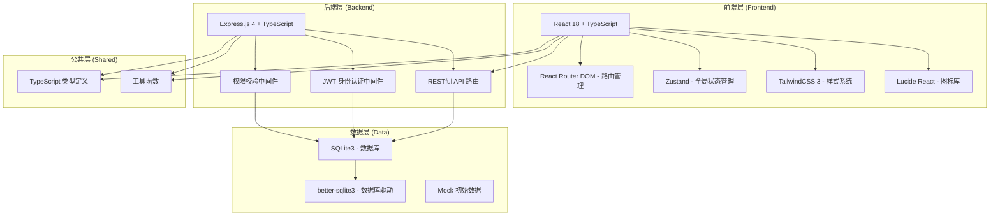
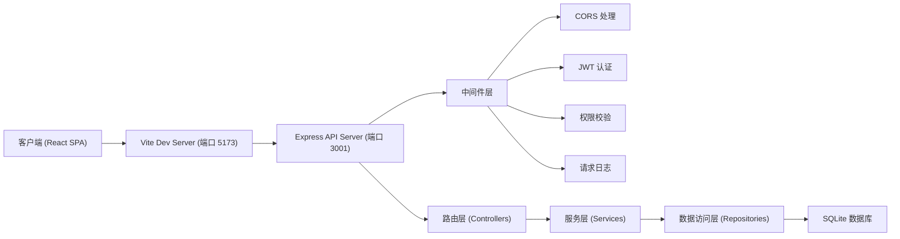
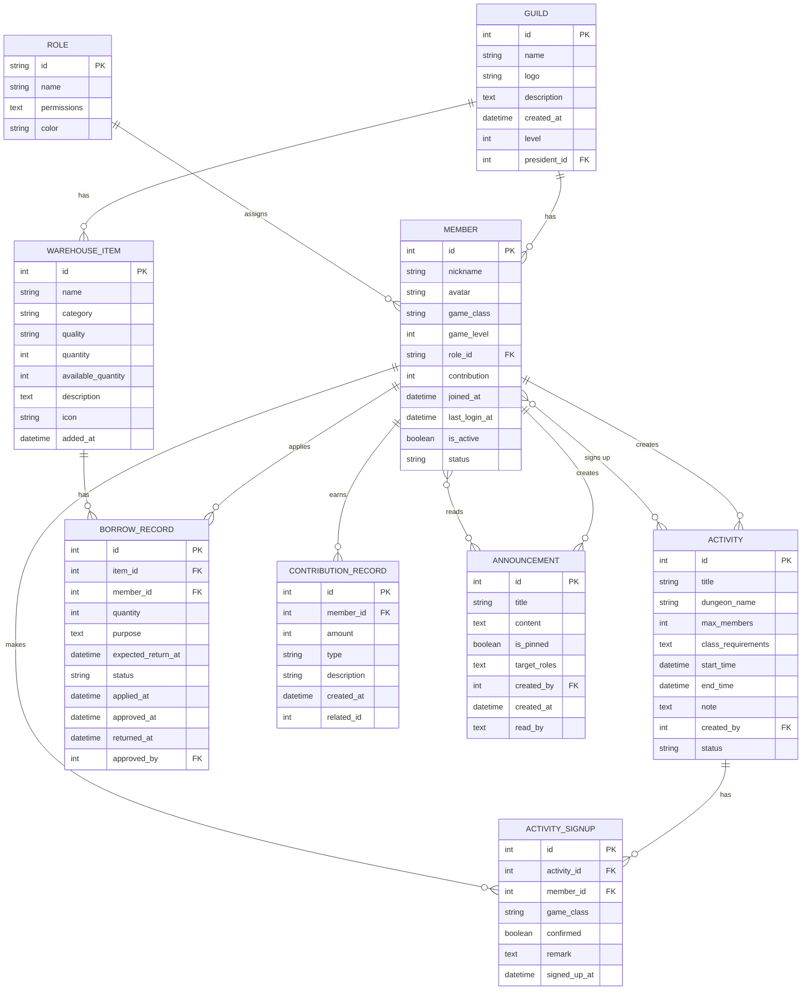

## 1. 架构设计



## 2. 技术说明

- **前端框架**: React@18 + TypeScript + Vite
- **后端框架**: Express@4 + TypeScript
- **样式方案**: TailwindCSS@3 + CSS Variables
- **状态管理**: Zustand
- **路由管理**: React Router DOM@6
- **图标库**: Lucide React
- **数据库**: SQLite3 (better-sqlite3)
- **初始化工具**: vite-init (react-express-ts 模板)
- **认证方式**: JWT Token

## 3. 路由定义

### 前端路由

| 路由路径 | 页面名称 | 说明 |
|----------|----------|------|
| `/` | 公会总览页 | 首页，展示公会概览信息 |
| `/members` | 成员管理页 | 成员列表、审批、职位管理 |
| `/activities` | 活动中心页 | 活动列表、发起活动、报名管理 |
| `/warehouse` | 公会仓库页 | 物品管理、借用归还流程 |
| `/contribution` | 贡献度系统页 | 贡献记录、排行榜、捐献 |
| `/announcements` | 公告板页 | 公告列表、发布、阅读 |
| `/login` | 登录页 | 用户登录（模拟角色切换） |

### 后端 API 路由

| 方法 | 路径 | 说明 |
|------|------|------|
| POST | `/api/auth/login` | 用户登录 |
| GET | `/api/guild` | 获取公会信息 |
| PUT | `/api/guild` | 更新公会信息 |
| GET | `/api/members` | 获取成员列表 |
| GET | `/api/members/pending` | 获取待审批申请 |
| POST | `/api/members/applications` | 提交加入申请 |
| PUT | `/api/members/:id/approve` | 审批通过成员 |
| PUT | `/api/members/:id/reject` | 拒绝成员申请 |
| PUT | `/api/members/:id/role` | 更新成员职位 |
| PUT | `/api/members/:id/active` | 更新成员活跃状态 |
| GET | `/api/roles` | 获取职位列表及权限 |
| GET | `/api/activities` | 获取活动列表 |
| POST | `/api/activities` | 创建新活动 |
| PUT | `/api/activities/:id` | 更新活动信息 |
| POST | `/api/activities/:id/signup` | 成员报名活动 |
| DELETE | `/api/activities/:id/signup` | 取消报名 |
| PUT | `/api/activities/:id/confirm` | 确认报名名单 |
| GET | `/api/warehouse` | 获取仓库物品列表 |
| POST | `/api/warehouse` | 新增物品 |
| PUT | `/api/warehouse/:id` | 编辑物品 |
| GET | `/api/warehouse/borrows` | 获取借用记录 |
| POST | `/api/warehouse/borrows` | 提交借用申请 |
| PUT | `/api/warehouse/borrows/:id/approve` | 审批借用 |
| PUT | `/api/warehouse/borrows/:id/return` | 确认归还 |
| GET | `/api/contributions` | 获取贡献度记录 |
| GET | `/api/contributions/ranking` | 获取月度贡献排行 |
| POST | `/api/contributions` | 新增贡献记录 |
| POST | `/api/contributions/donate` | 资源捐献 |
| GET | `/api/announcements` | 获取公告列表 |
| POST | `/api/announcements` | 发布公告 |
| PUT | `/api/announcements/:id/read` | 标记公告已读 |
| GET | `/api/stats/activity` | 获取活跃度统计数据 |

## 4. API 数据类型定义

```typescript
// 共享类型定义
export interface Guild {
  id: number;
  name: string;
  logo: string;
  description: string;
  createdAt: string;
  level: number;
  memberCount: number;
  presidentId: number;
}

export type RoleType = 'president' | 'vice_president' | 'leader' | 'member';

export interface Role {
  id: RoleType;
  name: string;
  permissions: string[];
  color: string;
}

export interface Member {
  id: number;
  nickname: string;
  avatar: string;
  gameClass: string;
  gameLevel: number;
  roleId: RoleType;
  contribution: number;
  joinedAt: string;
  lastLoginAt: string;
  isActive: boolean;
  status: 'approved' | 'pending' | 'rejected';
}

export interface Activity {
  id: number;
  title: string;
  dungeonName: string;
  maxMembers: number;
  classRequirements: Record<string, number>;
  startTime: string;
  endTime?: string;
  note?: string;
  createdBy: number;
  status: 'upcoming' | 'ongoing' | 'finished' | 'cancelled';
  signups: ActivitySignup[];
}

export interface ActivitySignup {
  id: number;
  activityId: number;
  memberId: number;
  gameClass: string;
  confirmed: boolean;
  remark?: string;
  signedUpAt: string;
}

export type ItemQuality = 'common' | 'uncommon' | 'rare' | 'epic' | 'legendary';
export type ItemCategory = 'weapon' | 'armor' | 'accessory' | 'material' | 'consumable' | 'resource';

export interface WarehouseItem {
  id: number;
  name: string;
  category: ItemCategory;
  quality: ItemQuality;
  quantity: number;
  availableQuantity: number;
  description?: string;
  icon?: string;
  addedAt: string;
}

export interface BorrowRecord {
  id: number;
  itemId: number;
  memberId: number;
  quantity: number;
  purpose: string;
  expectedReturnAt: string;
  status: 'pending' | 'approved' | 'returned' | 'rejected' | 'overdue';
  appliedAt: string;
  approvedAt?: string;
  returnedAt?: string;
  approvedBy?: number;
}

export interface ContributionRecord {
  id: number;
  memberId: number;
  amount: number;
  type: 'activity' | 'donate' | 'reward' | 'penalty';
  description: string;
  createdAt: string;
  relatedId?: number;
}

export interface Announcement {
  id: number;
  title: string;
  content: string;
  isPinned: boolean;
  targetRoles: RoleType[];
  createdBy: number;
  createdAt: string;
  readBy: number[];
}

export interface ApiResponse<T> {
  success: boolean;
  data?: T;
  message?: string;
  error?: string;
}
```

## 5. 服务器架构图



## 6. 数据模型

### 6.1 ER 图



### 6.2 数据库初始化 DDL

```sql
-- 公会表
CREATE TABLE IF NOT EXISTS guild (
  id INTEGER PRIMARY KEY AUTOINCREMENT,
  name TEXT NOT NULL,
  logo TEXT,
  description TEXT,
  created_at TEXT NOT NULL DEFAULT (datetime('now')),
  level INTEGER NOT NULL DEFAULT 1,
  president_id INTEGER
);

-- 职位表
CREATE TABLE IF NOT EXISTS role (
  id TEXT PRIMARY KEY,
  name TEXT NOT NULL,
  permissions TEXT NOT NULL DEFAULT '[]',
  color TEXT NOT NULL DEFAULT '#64748B'
);

-- 成员表
CREATE TABLE IF NOT EXISTS member (
  id INTEGER PRIMARY KEY AUTOINCREMENT,
  nickname TEXT NOT NULL,
  avatar TEXT,
  game_class TEXT NOT NULL,
  game_level INTEGER NOT NULL DEFAULT 1,
  role_id TEXT NOT NULL DEFAULT 'member',
  contribution INTEGER NOT NULL DEFAULT 0,
  joined_at TEXT,
  last_login_at TEXT NOT NULL DEFAULT (datetime('now')),
  is_active INTEGER NOT NULL DEFAULT 1,
  status TEXT NOT NULL DEFAULT 'pending',
  FOREIGN KEY (role_id) REFERENCES role(id)
);

-- 活动表
CREATE TABLE IF NOT EXISTS activity (
  id INTEGER PRIMARY KEY AUTOINCREMENT,
  title TEXT NOT NULL,
  dungeon_name TEXT NOT NULL,
  max_members INTEGER NOT NULL,
  class_requirements TEXT NOT NULL DEFAULT '{}',
  start_time TEXT NOT NULL,
  end_time TEXT,
  note TEXT,
  created_by INTEGER NOT NULL,
  status TEXT NOT NULL DEFAULT 'upcoming',
  FOREIGN KEY (created_by) REFERENCES member(id)
);

-- 活动报名表
CREATE TABLE IF NOT EXISTS activity_signup (
  id INTEGER PRIMARY KEY AUTOINCREMENT,
  activity_id INTEGER NOT NULL,
  member_id INTEGER NOT NULL,
  game_class TEXT NOT NULL,
  confirmed INTEGER NOT NULL DEFAULT 0,
  remark TEXT,
  signed_up_at TEXT NOT NULL DEFAULT (datetime('now')),
  FOREIGN KEY (activity_id) REFERENCES activity(id),
  FOREIGN KEY (member_id) REFERENCES member(id),
  UNIQUE(activity_id, member_id)
);

-- 仓库物品表
CREATE TABLE IF NOT EXISTS warehouse_item (
  id INTEGER PRIMARY KEY AUTOINCREMENT,
  name TEXT NOT NULL,
  category TEXT NOT NULL,
  quality TEXT NOT NULL DEFAULT 'common',
  quantity INTEGER NOT NULL DEFAULT 0,
  available_quantity INTEGER NOT NULL DEFAULT 0,
  description TEXT,
  icon TEXT,
  added_at TEXT NOT NULL DEFAULT (datetime('now'))
);

-- 借用记录表
CREATE TABLE IF NOT EXISTS borrow_record (
  id INTEGER PRIMARY KEY AUTOINCREMENT,
  item_id INTEGER NOT NULL,
  member_id INTEGER NOT NULL,
  quantity INTEGER NOT NULL,
  purpose TEXT NOT NULL,
  expected_return_at TEXT NOT NULL,
  status TEXT NOT NULL DEFAULT 'pending',
  applied_at TEXT NOT NULL DEFAULT (datetime('now')),
  approved_at TEXT,
  returned_at TEXT,
  approved_by INTEGER,
  FOREIGN KEY (item_id) REFERENCES warehouse_item(id),
  FOREIGN KEY (member_id) REFERENCES member(id),
  FOREIGN KEY (approved_by) REFERENCES member(id)
);

-- 贡献度记录表
CREATE TABLE IF NOT EXISTS contribution_record (
  id INTEGER PRIMARY KEY AUTOINCREMENT,
  member_id INTEGER NOT NULL,
  amount INTEGER NOT NULL,
  type TEXT NOT NULL,
  description TEXT NOT NULL,
  created_at TEXT NOT NULL DEFAULT (datetime('now')),
  related_id INTEGER,
  FOREIGN KEY (member_id) REFERENCES member(id)
);

-- 公告表
CREATE TABLE IF NOT EXISTS announcement (
  id INTEGER PRIMARY KEY AUTOINCREMENT,
  title TEXT NOT NULL,
  content TEXT NOT NULL,
  is_pinned INTEGER NOT NULL DEFAULT 0,
  target_roles TEXT NOT NULL DEFAULT '["member"]',
  created_by INTEGER NOT NULL,
  created_at TEXT NOT NULL DEFAULT (datetime('now')),
  read_by TEXT NOT NULL DEFAULT '[]',
  FOREIGN KEY (created_by) REFERENCES member(id)
);

-- 创建索引
CREATE INDEX IF NOT EXISTS idx_member_role ON member(role_id);
CREATE INDEX IF NOT EXISTS idx_member_status ON member(status);
CREATE INDEX IF NOT EXISTS idx_activity_status ON activity(status);
CREATE INDEX IF NOT EXISTS idx_activity_start_time ON activity(start_time);
CREATE INDEX IF NOT EXISTS idx_borrow_status ON borrow_record(status);
CREATE INDEX IF NOT EXISTS idx_contribution_member ON contribution_record(member_id);
CREATE INDEX IF NOT EXISTS idx_announcement_pinned ON announcement(is_pinned, created_at DESC);
```
