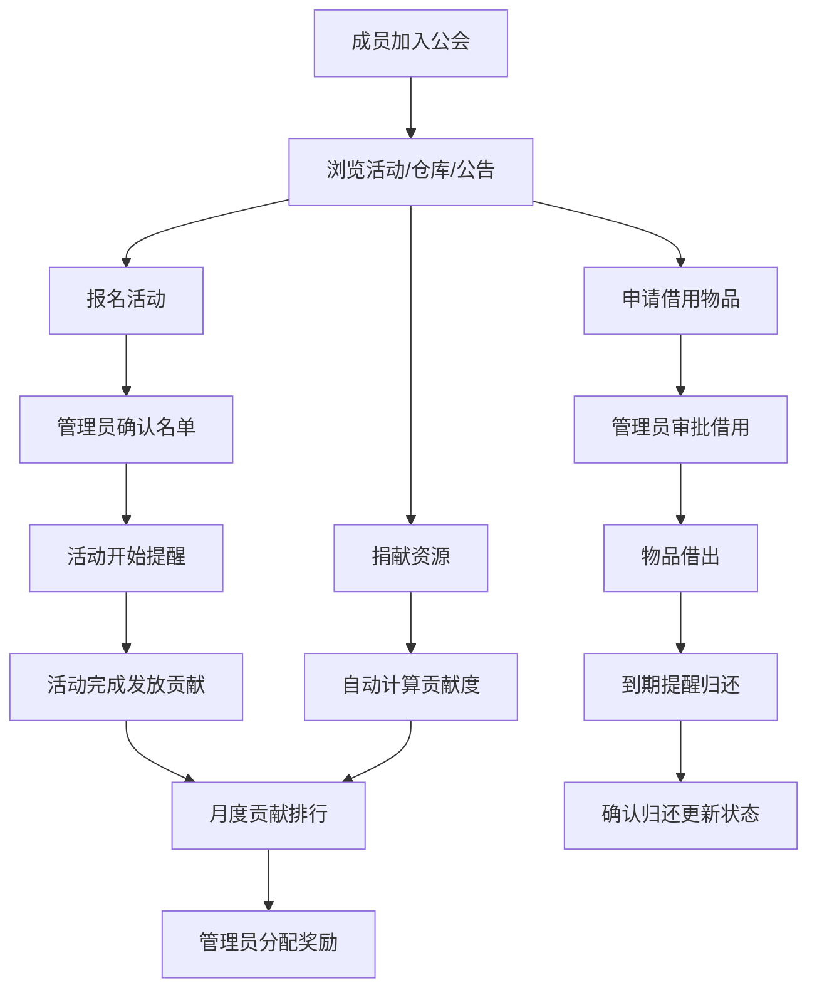

## 1. 产品概述

游戏公会协作管理工具，为网络游戏公会提供一站式协作管理平台。解决公会成员管理混乱、活动组织效率低、资源分配不透明等核心痛点。目标用户为网络游戏公会会长、管理员及全体成员。

- 核心价值：提升公会协作效率，实现资源透明化管理，激发成员活跃度与归属感
- 产品定位：专业级游戏公会协作与资源管理 SaaS 工具

## 2. 核心功能

### 2.1 用户角色

| 角色 | 注册方式 | 核心权限 |
|------|----------|----------|
| 会长 | 创建公会时自动成为 | 全部权限：公会设置、成员审批、职位分配、活动管理、仓库管理、公告发布 |
| 副会长 | 会长任命 | 成员审批、活动管理、仓库管理、公告发布、查看贡献度 |
| 组长 | 会长/副会长任命 | 组织小组活动、查看小组成员、审批仓库借用申请 |
| 普通成员 | 申请加入并审批通过 | 报名活动、申请借用仓库物品、查看公告、查看贡献度排行、捐献资源 |

### 2.2 功能模块

1. **公会总览页（首页）**：公会信息卡片、近期活动、最新公告、贡献度 Top5、活跃度概览
2. **成员管理页**：成员列表、申请审批、职位管理、活跃度统计、不活跃成员标记
3. **活动中心页**：活动列表、发起团队副本报名、报名确认、活动提醒、活动历史
4. **公会仓库页**：物品列表、借用申请、借用审批、归还管理、物品新增/编辑
5. **贡献度系统页**：贡献记录、月度排行榜、奖励分配、资源捐献
6. **公告板页**：公告列表、发布公告、已读/未读标记、公告详情

### 2.3 页面详情

| 页面名称 | 模块名称 | 功能描述 |
|----------|----------|----------|
| 公会总览页 | 公会信息卡片 | 展示公会名称、Logo、会徽、创建日期、成员总数、公会等级、会长信息 |
| 公会总览页 | 近期活动 | 展示即将开始的 3 个活动，含倒计时、报名人数 |
| 公会总览页 | 最新公告 | 展示最近 3 条未读公告，点击跳转详情 |
| 公会总览页 | 贡献度 Top5 | 本月贡献度前 5 名成员展示，含头像、昵称、贡献值 |
| 公会总览页 | 活跃度概览 | 最近 7 天活跃趋势图、活跃/不活跃成员数量统计 |
| 成员管理页 | 成员列表 | 分页展示所有成员，支持按职位、活跃度、加入时间筛选，支持搜索 |
| 成员管理页 | 申请审批 | 待审批申请列表，支持通过/拒绝操作，附带申请留言展示 |
| 成员管理页 | 职位管理 | 职位列表展示、职位权限配置、成员职位调整 |
| 成员管理页 | 活跃度统计 | 成员最后登录时间、连续活跃天数、月度活动参与次数 |
| 成员管理页 | 不活跃标记 | 长期（>14天）未登录成员自动标记，支持手动标记/恢复 |
| 活动中心页 | 活动列表 | Tab 切换：即将开始 / 进行中 / 已结束，卡片展示活动信息 |
| 活动中心页 | 发起活动 | 创建团队副本：设置标题、副本名称、人数上限、职业要求、开始时间、备注 |
| 活动中心页 | 报名确认 | 成员报名列表、职业分布、确认/取消报名、候补队列管理 |
| 活动中心页 | 活动提醒 | 活动开始前 24 小时、1 小时自动提醒，支持手动发送提醒 |
| 活动中心页 | 活动历史 | 历史活动列表、参与成员、完成状态、贡献度发放记录 |
| 公会仓库页 | 物品列表 | 分类展示装备/材料/资源，支持搜索、筛选、排序，展示数量、品质、当前状态 |
| 公会仓库页 | 借用申请 | 选择物品、填写借用时长、用途说明，提交申请 |
| 公会仓库页 | 借用审批 | 待审批借用申请列表，支持通过/拒绝，设置归还期限 |
| 公会仓库页 | 归还管理 | 借用中物品列表、逾期提醒、确认归还更新状态 |
| 公会仓库页 | 物品管理 | 新增/编辑物品信息：名称、分类、品质、数量、描述、图标 |
| 贡献度系统页 | 贡献记录 | 个人贡献明细：活动参与、资源捐献、其他奖励，按时间倒序 |
| 贡献度系统页 | 月度排行榜 | 本月/上月贡献度排行，支持切换，展示前 20 名，含个人排名高亮 |
| 贡献度系统页 | 奖励分配 | 管理员根据排行设置奖励方案，支持批量发放奖励记录 |
| 贡献度系统页 | 资源捐献 | 选择资源类型、填写数量、提交捐献，自动计算贡献值 |
| 公告板页 | 公告列表 | 已读/未读状态标识、置顶公告优先展示、按发布时间倒序 |
| 公告板页 | 发布公告 | 标题、内容（富文本）、优先级（置顶/普通）、发布范围（全员/指定职位） |
| 公告板页 | 已读标记 | 成员阅读公告后自动标记已读，展示已读/未读人数统计 |
| 公告板页 | 公告详情 | 完整公告内容、发布者、发布时间、阅读记录 |

## 3. 核心流程

### 3.1 成员加入公会流程
游客访问 → 提交加入申请（填写昵称、职业、游戏等级、申请留言）→ 管理员收到申请通知 → 审批（通过/拒绝）→ 通过后自动成为普通成员，收到入会通知

### 3.2 活动组织流程
管理员发起活动（填写副本信息、人数、职业要求、时间）→ 活动发布 → 成员收到活动通知 → 成员报名（选择职业角色）→ 管理员确认名单/职业分配 → 活动开始前自动提醒 → 活动结束 → 发放参与贡献度

### 3.3 仓库借用流程
成员浏览仓库物品 → 提交借用申请（物品、时长、用途）→ 管理员审批 → 通过后物品状态变为"借用中"→ 到期前提醒归还 → 成员确认归还 → 管理员核实 → 物品状态更新为"可用"

### 3.4 贡献度获取流程
活动参与（+20）/ 资源捐献（按数量计算）/ 管理员手动奖励 → 贡献记录入库 → 月度排行更新 → 排行榜公示 → 管理员分配奖励

## 4. 用户界面设计

### 4.1 设计风格

**整体风格：史诗奇幻游戏主题**
- **主色调**：深邃夜色蓝（#0A0F1E）作为背景，搭配暗金色（#C9A84C）作为主强调色
- **辅助色**：魔法紫（#7C3AED）用于高亮和状态，锻造橙（#F97316）用于警告和重要提示
- **中性色**：石板灰系列（#1E293B / #334155 / #64748B / #94A3B8 / #CBD5E1 / #F1F5F9）
- **按钮风格**：带金色描边的圆角按钮，悬停时有光晕效果，主按钮为渐变金色
- **字体**：标题使用 Cinzel（衬线字体，史诗感），正文使用 Noto Sans SC
- **布局风格**：侧边栏导航 + 主内容区，卡片式布局，大量使用深色玻璃拟态（glassmorphism）
- **装饰元素**：微妙的几何纹样边框、金色分隔线、魔法粒子背景效果
- **图标风格**：Lucide 图标配合金色/紫色渐变填充

### 4.2 页面设计概述

| 页面名称 | 模块名称 | UI 元素 |
|----------|----------|----------|
| 公会总览页 | 公会信息卡片 | 深色玻璃卡、金色边框装饰、会徽圆形展示、统计数据金色大字 |
| 公会总览页 | 近期活动 | 倒计时数字动画、进度条显示报名进度、悬停发光效果 |
| 公会总览页 | 贡献度 Top5 | 排名奖牌图标（金/银/铜）、头像带职业光环、贡献值动态数字 |
| 成员管理页 | 成员列表 | 表格布局、行悬停金色高亮、职位标签彩色、活跃度状态指示灯 |
| 成员管理页 | 申请审批 | 左右分栏布局、左侧申请列表、右侧详情+操作按钮 |
| 活动中心页 | 活动卡片 | 副本主题封面图、时间徽章、职业图标组、报名人数气泡 |
| 活动中心页 | 发起活动表单 | 分组表单、职业要求多选标签、时间选择器带日历 |
| 公会仓库页 | 物品网格 | 物品品质边框颜色（白/绿/蓝/紫/橙）、悬停放大+详情预览 |
| 贡献度系统页 | 排行榜 | 前三名颁奖台设计、头像+昵称+贡献值柱状图、滚动动画 |
| 公告板页 | 公告列表 | 置顶公告金色高亮徽章、未读红点提示、已读灰色渐变 |

### 4.3 响应式设计

采用桌面优先设计，在 1280px 及以上分辨率达到最佳效果：
- **桌面端（≥1280px）**：完整侧边栏 + 双栏/三栏内容布局
- **平板端（768px-1279px）**：可折叠侧边栏 + 单栏/双栏自适应
- **移动端（<768px）**：顶部汉堡菜单导航 + 单栏堆叠布局，表格转为卡片展示

### 4.4 动效与交互

- 页面加载：元素渐入 + 轻微上浮动画，stagger 延迟 50ms
- 卡片悬停：金色光晕边框、轻微上浮（translateY(-4px)）、阴影加深
- 按钮点击：缩放反馈（scale(0.97)）+ 金色涟漪效果
- 数据变化：数字滚动动画（贡献值、倒计时）
- 侧边导航：选中项金色下划线滑动动画
- 通知提醒：右上角滑入 + 轻微震动效果
